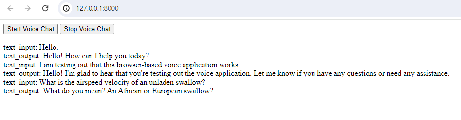

# Browser Text and Audio

The [Quickstart](../getting_started/index) provides a very basic intro to a browser based audio application.  In that 
application, two way audio was set up with the browser and the audio was run through a VoiceStream to create a conversation
with a Google LLM.

In this example, we expand on the quickstart by having the browser UI display the transcript of the conversation on the page.
This demonstrates some of the flow controls available within VoiceStream.



The full code for this application is in the [examples directory](https://github.com/DaveDeCaprio/voice-stream/blob/main/examples/quickstart.py) 
of the VoiceStream repo.  There is a full copy of the source at the bottom of this page also.

## Design

This example is similar to the Quickstart, except that the browser makes two Websocket connections to the server.  One 
for the audio, and a second connection to pass the text transcript.  Additionally, the client now generates a unique
id for the call so that the server can associate the two websockets together. 

Within the server, the core audio flow stays the same, but we add two :func:`~voice_stream.fork_step`s to extract the 
text.  One after the speech recognition and another before the text-to-speech.

The text is converted to `TextInput` and `TextOutput` objects that are put on a queue.  The text websocket reads from 
this queue and sends all items to the browser.

## Browser Code

The `startAudio` and `stopAudio` functions from the quickstart are still used to handle the audio websocket.  We add
`startChat` and `stopChat` functions to set up the unique id and set up the second websocket.

`startChat` sets up a websocket handler that adds the text sent from the server to the page.

```{literalinclude} ../../examples/browser.py
:language: javascript
:start-after: /* Set up the websockets */
:end-before: /* Close the websockets */
```

## Text Websocket

The handler for the text websocket is very simple.  We first set up a global variable called `call_queues` to hold the 
queues which will be used to send the transcripts.  

The handler first gets the appropriate queue, which will be set up in the call to the audio websocket.

It then routes everything from the queue directly to the websocket using :func:`~voice_stream.queue_source` and 
:func:`~voice_stream.integrations.fastapi.fastapi_websocket_text_sink`.

```{literalinclude} ../../examples/browser.py
:language: python
:start-after: "# Text Endpoint"
:end-before: "# Audio Endpoint"
```

## Audio Websocket

Here is the audio websocket endpoint.  The differences between this and the quickstart are highlighted.

```{literalinclude} ../../examples/browser.py
:language: python
:start-after: "# Audio Endpoint"
:emphasize-lines: 3,10,18,25-29
:linenos:
```

* In line 3, we create a queue and assign it to the id passed from the browser.  This will be used by the text websocket.
* In lines 10 and 18, we use a :func:`~voice_stream.fork_step` to get a copy of the text input and output to send to the text websocket.
* In lines 25-28 the input and output streams are converted into objects, merged together, and sent to the queue.
* In line 29, we `await` both the original audio stream and text stream.  It's important to always await on all streams in a data flow. 

## Full Source Code

```{literalinclude} ../../examples/browser.py
:language: python
```

