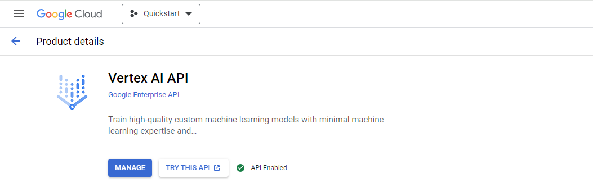
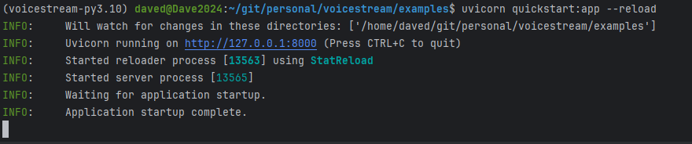
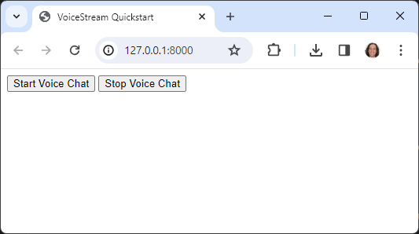

# QuickStart

In this quickstart we'll build a fully functional voice bot with a browser interface that allows you to have a two-way 
conversation with [Google's Gemini][gemini] model.

The server uses [FastAPI][fastapi] to serve a web page with start and stop audio buttons.   

## Installation

```{include} ../../README.md
:start-after: <!-- start install -->
:end-before: <!-- end install -->
```

To use integrations, you can install the packages directly, or use the 'extras' syntax to install them as part of voice-stream.
Run the command below to install the 'quickstart' extra dependencies.  This will install [FastAPI][fastapi] and the Google Cloud Python clients.

   ```shell
   pip install voice-stream[quickstart]
   ```

Most other integrations can be installed in the same way, by replacing 'quickstart' with the name of the integration.

   ```shell
   pip install voice-stream[twilio,openai]
   ```

## FastAPI Server

Here is the code for our server.  You can also find it in the [examples directory](https://github.com/DaveDeCaprio/voice-stream/blob/main/examples/quickstart.py) of the VoiceStream repo.

```{literalinclude} ../../examples/quickstart.py
:language: python
```

Save this code as `quickstart.py`.  We'll walk through it, but for now you can run it using [Uvicorn][uvicorn], which is 
a standard way to run FastAPI servers.  Uvicorn will already be 
installed if you installed with `pip install voice-stream[quickstart]` above.

```shell
uvicorn quickstart:app
````

You should see the following exception:
```python
google.auth.exceptions.DefaultCredentialsError: File google_creds.json was not found.
```

If you got that error, then you've got everything set up so far.  It's failing because we haven't configured your Google 
Cloud setup yet.  We will do that in the next section.

## {.bg-warning w=50px} Google Cloud Setup

In this QuickStart, we will use Google Cloud for the [Gemini][gemini] LLM, Speech Recognition, and Text-To-Speech.  There are two
steps to that.  First, we need to set up credentials to call the APIs, and then we need to explicitly enable the
APIs we want to use.

### Prerequisites
You'll need to set up a Google Cloud account and create a project.  You can do this for free and get free credits that 
will cover many hours of VoiceBot conversation.

If you don't already have an account, follow the instructions at [Getting Started with Google Cloud](https://console.cloud.google.com/getting-started)    

### Credentials

In order to call Google Cloud APIs you need a set of credentials that identifies your project.  We'll create those now.
For this quickstart we will create a service account to access the APIs and then create and download a set of 
credentials for that account.

```{admonition} Service Account Step by Step
1. Navigate to <https://console.cloud.google.com/apis/credentials>
2. Click on `+ CREATE CREDENTIALS` and select `Servie Account`.
3. Fill in any value for *Service account name* and press `CREATE AND CONTINUE`.
4. Under *Select a role*, select *Basic > Owner* and press `CONTINUE`.
5. Press `DONE`.
4. You should see your new service account listed.  Click on it to go to the details.
5. Go to the *KEYS* tab, then click on `+ ADD KEY` and select `Create new key`. 
6. Ensure the key type is JSON and click `CREATE`.  This will download a JSON file with your credentials.
7. Save the JSON file as `google_creds.json` in the same directory as this quickstart.
```

Now if you try to run the quickstart again.
```shell
uvicorn quickstart:app
````
You should get another big exception.  If you scroll up, it should contain a message like this: 

```
    status = StatusCode.PERMISSION_DENIED
    details = "Vertex AI API has not been used in project XXXXXXXXX before or it is disabled. Enable it by visiting https://console.developers.google.com/apis/api/aiplatform.googleapis.com/overview then retry. If you enabled this API recently, wait a few minutes for the action to propagate to our systems and retry."
```

This is because even though you have valid credentials, the individual APIs all need to be turned on for the project.  Let's fix that.


### Enable APIs 

In Google Cloud, individual APIs have to be specifically enabled for each project.  For this quickstart, go to the 3 
links below, and click "Enable".

* **[Vertex AI](https://console.cloud.google.com/apis/library/aiplatform.googleapis.com)** - Enables the Gemini LLM
* **[Cloud Speech-to-Text API](https://console.cloud.google.com/apis/library/speech.googleapis.com)** - Enables speech recognition
* **[Cloud Text-to-Speech API](https://console.developers.google.com/apis/api/texttospeech.googleapis.com/overview)** - Enables text-to-speech

Check the dropdown at the top of the window to make sure you are in the correct project.  *The screenshot below shows the "quickstart" project.*



## Run the Quickstart

Once your Google Cloud setup is configured, the quickstart should run successfully.  Try running it again, turning on auto-reloading this time.

```shell
uvicorn quickstart:app  --reload
````
You should see the server start up, with something like the following output:



Now, point your browser to < http://127.0.0.1:8000>.  You should see a simple page like this:



Press "Start Voice Chat" and begin talking!  Gemini will talk back and converse with you as long as you'd like.

## Next Steps

From here, explore the rest of the documentation to learn more about VoiceStream.
* [Quickstart Walkthough](./walkthrough) - A full walkthrough of the code in this quickstart.
* [Concepts](../concepts/index) - A methodical intro to the concepts underlying VoiceStream.
* [Cookbook](../cookbook/index) - How to take advantage of the various capability of VoiceStream.
* [GitHub Examples](https://github.com/DaveDeCaprio/voice-stream/blob/main/examples/quickstart.py) - To view and run the code for fully worked examples.
* [API Reference](../reference/index) - If you are into reading API docs directly.


[fastapi]: https://fastapi.tiangolo.com/
[gemini]: https://deepmind.google/technologies/gemini/#introduction
[uvicorn]: https://www.uvicorn.org/

```{toctree}
:hidden:

walkthrough
```