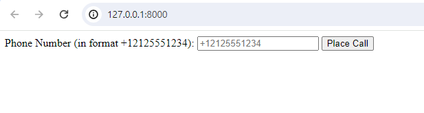

# Twilio Demo

This app demonstrates a basic integration with Twilio.  It can make a call to any number, and then provide the user
with a voice interface to GPT-4 during the call.

## App Server Setup

### Python Setup

The recommended way to run this example is to set up a virtual environment and install your dependencies there.

1. Create your virtualenv `python -v venv .venv`
2. Run `source .venv/bin/activate`
3. Run `pip install -r requirements.txt`

### Set up Google APIs and Credentials 

You will need to set up Google credentials and APIs to use the server.  See the [quickstart](https://voice-stream.readthedocs.io/en/latest/getting_started/index.html).
If you have already done the quickstart, copy your `google_cred.json` file to this example directory.

### Set up Twilio account and get a phone number

In order to place calls using Twilio you will need an account with credentials and you will also need a phone number.
You have a default phone number when you create a new account.  This can only be used to make calls to verified numbers.
That will work for this demo, or you can purchase a number.

Use the [Twilio console](https://www.twilio.com/console/voice/numbers) to set up your account.

### Create an .env file with your account details.

1. Rename the `.env.example` file to `.env`
2. Add your `OPENAI_API_KEY` to the file
3. Add your Twilio account information to the file.

All of these variables will be read in as environment variables on startup using `load_dotenv`

### Make your server publicly available

In order to make calls using Twilio, you must have a publicly available webhook for Twilio to call.  You can use ngrok 
to set one up quickly and for free.

1. Install [ngrok](https://ngrok.com/download)
2. Run `ngrok http 8000`
2. Ngrok will host your server at `https://<domain>.ngrok-free.app`
3. Take the domain name from the URL ngrok generated and set that in your `.env` file
4. Point a browser to the ngrok URL.  Follow the directions there to connect your ngrok account.

## Run the server

Run the app with:

```uvicorn main:app --reload```

Point your browser to: http: and you should see:



If you enter a phone number and hit call, it will connect.

## Walkthrough

See a full walkthrough of the code at: [https://voice-stream.readthedocs.io/en/latest/cookbook/phone.html]